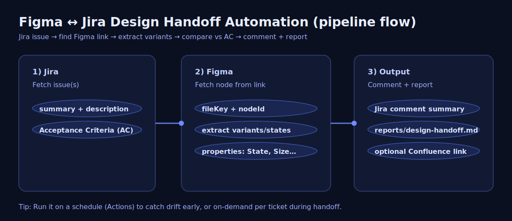
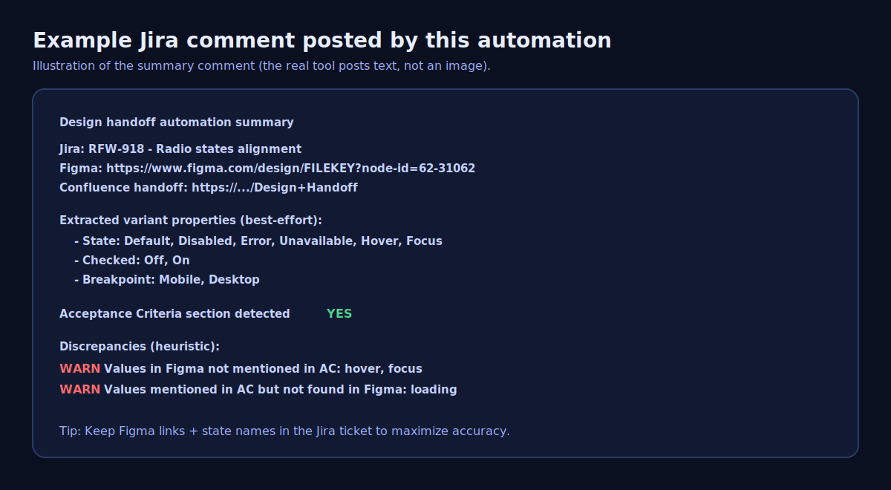
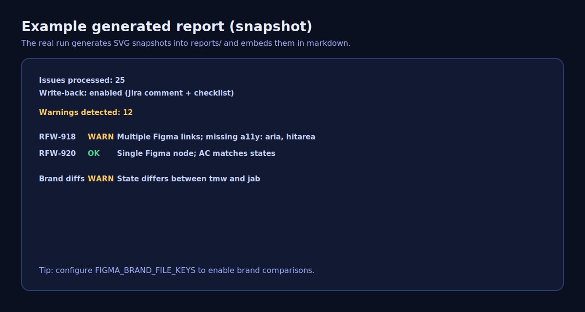
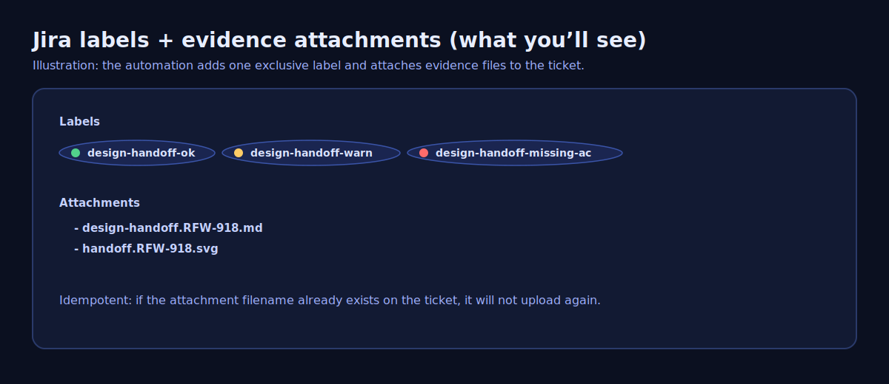

# tb-design-handoff-automation

Automates **Figma ↔ Jira “design handoff”**:

- When a Jira issue includes a Figma link, this tool:
  - Extracts **component states/variants** from the referenced Figma node
  - Compares them to **Acceptance Criteria** text in Jira (best-effort)
  - Flags discrepancies:
    - AC mentions states not present in Figma
    - Figma has states not mentioned in AC
  - Posts a **summary comment** back to the Jira ticket
  - Optionally includes a **Confluence handoff page link**
  - Sends **Slack/Teams notifications** when drift/warnings are detected
  - Optionally **auto-inserts a Design Handoff Checklist** into the Jira description if missing
  - Optionally **adds Jira labels** and **uploads evidence attachments** to the Jira ticket



**Detailed system description:** [docs/DESIGN-HANDOFF-SYSTEM.md](docs/DESIGN-HANDOFF-SYSTEM.md) – flow, components, variant extraction, mismatch detection, reports, and configuration.

**Team presentation:** [docs/design-handoff-presentation.pptx](docs/design-handoff-presentation.pptx) – downloadable PowerPoint (idea, implementation, process). Source: [docs/design-handoff-presentation.md](docs/design-handoff-presentation.md). Regenerate with `npm run slides:export`.

## Why this is useful (benefits)

- **Faster handoff**: PM/Design/Dev can see “what states exist” in Figma without manually enumerating them.
- **Less drift**: catches “Figma says X, Jira AC says Y” early—before code and QA diverge.
- **Better QA readiness**: QA gets a clear checklist of expected states from the same source every time.
- **Auditability**: every run leaves evidence (Jira comment + `reports/design-handoff.md`).
- **Scales to many tickets**: run via JQL for the whole project/sprint.

## What it does today (v1)

- Works with Jira Cloud REST v3
- Works with Figma REST API `/files/:key/nodes`
- Detects Figma variants by parsing **Component Set / Component names** (common “Variant=Value” patterns)
- Handles **multiple Figma links** per ticket (detects duplicates/conflicts)
- Supports **multi-file / multi-brand** diffs (TMW/JAB/MSP) when configured
- Runs **accessibility requirement checks** against AC text (heuristic)
- Automates Jira labels:
  - `design-handoff-ok`
  - `design-handoff-warn`
  - `design-handoff-missing-ac`
- Uploads evidence attachments to Jira (optional + idempotent)
- Posts a Jira comment summarizing:
  - Figma links found
  - Extracted variant properties + values
  - “AC contains / missing” signals







## What it does NOT do yet (so expectations are clear)

- Does not automatically *rewrite* Jira Acceptance Criteria (it posts a comment with findings).
- Variant extraction is **best-effort** and depends on Figma naming conventions (e.g., `State=Default`).
- “Designs without tickets” requires a defined Figma scope (page/component set) or a naming convention (e.g., Jira keys in node names).

## First-time setup (after cloning)

1. **Create your config file** (the repo has no `.env`; it’s gitignored):
   ```bash
   cp config/example.env .env
   ```

2. **Edit `.env`** and set the **required** variables:
   - `JIRA_BASE_URL` – your Jira base URL, e.g. `https://your-company.atlassian.net` (no trailing slash).
   - `JIRA_EMAIL` – the email you use to log in to Jira.
   - `JIRA_API_TOKEN` – [Create an API token](https://id.atlassian.com/manage-profile/security/api-tokens) in your Atlassian account and paste it here.
   - `FIGMA_TOKEN` – [Create a Figma personal access token](https://www.figma.com/developers/api#access-tokens) and paste it here.

3. **Run the script** from the project root. The script **loads `.env` automatically**, so you don’t need to export variables:
   ```bash
   node ./scripts/run.mjs --issue=RFW-1234
   ```
   Or use dry-run to avoid writing to Jira:
   ```bash
   node ./scripts/run.mjs --issue=RFW-1234 --dry-run=true
   ```

If you see `JIRA_BASE_URL is required`, the script didn’t find a `.env` in the current directory. Make sure you created `.env` (step 1) and that you’re running the command from the **project root** (the folder that contains `config/` and `scripts/`).

## Setup (local) – reference

Copy `config/example.env` to `.env` and fill in the values. The run script loads `.env` automatically when you execute it from the project root.

### Required credentials

- **Jira**: `JIRA_BASE_URL`, `JIRA_EMAIL`, `JIRA_API_TOKEN`
- **Figma**: `FIGMA_TOKEN`
- **Optional**: `CONFLUENCE_HANDOFF_PAGE_URL` (just used as a link in the Jira comment for now)
- **Optional**: `FIGMA_BRAND_FILE_KEYS` for multi-brand diffs (e.g. `tmw=<fileKey>,jab=<fileKey>,msp=<fileKey>`)
- **Optional**: `SLACK_WEBHOOK_URL` and/or `TEAMS_WEBHOOK_URL` for notifications
- **Optional**: `WRITE_BACK` (`true`/`false`) to control whether the tool modifies Jira (comment + checklist)
- **Optional**: `JIRA_LABEL_AUTOMATION` (`true`/`false`)
- **Optional**: `JIRA_ATTACH_EVIDENCE` (`true`/`false`)

## Run (local)

Run for a single issue:

```bash
node ./scripts/run.mjs --issue=RFW-1234
```

Run for multiple issues (comma-separated keys):

```bash
node ./scripts/run.mjs --issue=RFW-1234,RFW-1235,RFW-1236
```

Run for multiple issues via JQL:

```bash
node ./scripts/run.mjs --jql="project = RFW AND updated >= -7d order by updated DESC"
```

Dry-run (no Jira writes; report and would-be comments go to `reports/design-handoff.md` and `reports/jira-comments.txt`):

```bash
node ./scripts/run.mjs --issue=RFW-1234 --dry-run=true
node ./scripts/run.mjs --issue=RFW-1234,RFW-1235 --dry-run=true
```

### Tips for best results

- Put the **Figma link** in the Jira description (or summary).
- Name variants in Figma like `State=Default, Checked=On` so the extractor can build a proper state matrix.
- Add an **“Acceptance Criteria”** section header in Jira. The tool uses that as the target text to compare.

## Outputs

- Writes a markdown report to `reports/design-handoff.md`
- Writes SVG “snapshots” to `reports/` (embedded in the markdown report)
- Posts a Jira comment to each processed issue
- Updates Jira labels (optional)
- Uploads attachments (optional):
  - `design-handoff.<ISSUE>.md`
  - `handoff.<ISSUE>.svg`

**Dry-run only** (when `--dry-run=true`):
- `reports/jira-comments.txt` – would-be Jira comment text per ticket
- `reports/dry-run-results-and-mismatches.txt` – per-ticket results and mismatches
- `reports/design-handoff-report.html` – **visual HTML report** (open in browser): Figma embeds, handoff snapshots, and colour-coded mismatches (In Figma not in AC / In AC not in Figma). Open from the `reports/` folder so images load; for Figma iframes to work, serve the folder (e.g. `npx serve reports -p 3333` then open `http://localhost:3333/design-handoff-report.html`).

## GitHub Actions

Includes a workflow to run:
- manually (workflow_dispatch) with `issue` or `jql`
- scheduled (optional)

### Configure GitHub Actions secrets

Repo → Settings → Secrets and variables → Actions → Secrets:

- `JIRA_BASE_URL`
- `JIRA_EMAIL`
- `JIRA_API_TOKEN`
- `FIGMA_TOKEN`
- (optional) `CONFLUENCE_HANDOFF_PAGE_URL`
- (optional) `DEFAULT_JQL` (used when you run without providing an input)
- (optional) `FIGMA_BRAND_FILE_KEYS`
- (optional) `SLACK_WEBHOOK_URL`
- (optional) `TEAMS_WEBHOOK_URL`
- (optional) `WRITE_BACK`

### Run it from Actions

- Actions → **Design Handoff (Figma ↔ Jira)** → Run workflow
  - Provide `issue` **or** `jql`

## Troubleshooting

- **No Figma link found**: ensure the Jira ticket contains a full `https://www.figma.com/design/...` URL.
- **No variants detected**: your node may not be a Component Set, or variant naming is not using `key=value`.
- **AC not detected**: add a header like “Acceptance Criteria” in the description.
- **Tool inserted a checklist**: this happens when `WRITE_BACK=true` and the ticket didn’t already contain the checklist marker.
- **Permission errors**: verify your Jira and Figma tokens have access to the project/file.


